<!-- omit from toc -->
# Robusto orchestration
This is the implementation of the Robusto orchestration.

- [Purpose](#purpose)
- [Settings](#settings)
  - [Enable the conductor](#enable-the-conductor)
  - [Sleep cycle timing](#sleep-cycle-timing)
    - [Sleep cycle length](#sleep-cycle-length)
    - [Awake time](#awake-time)

# Purpose
For devices in a network to be able to conserve energy, they need to go down in low-energy modes and shut down some aspects, like networking. 
The orchestration enables devices to be synchronized so that they can wake up at the same time.
# Settings
_Conductor configuration ->_

The settings are kept in this submenu in the Robusto configuration
## Enable the conductor
_-> Enable the conductor server_

This enables the conductor service, and causes the conductor to go into deep sleep when the wake time is over. 
## Sleep cycle timing

```mermaid
gantt
    dateFormat  s
    title  The conductor sleep cycle:    
    section Conductor  
    Sleep cycle length        :crit,active, cycle,0,120s
    Awake time         :active, wake, 0,36s
    Extension     :active, ext,after wake,10s
    Sleep         :active, sleep, after ext, 70s
    Server margin   :active, after sleep,4s
    section Voltages,<br/>amperes,<br/>and load
    Awake margin         :active, w1, 0, 3s
    Collect data       :active, c1, after w1, 2s
    Report some data to peer :active, r1, after c1, 1s
    Ask for sleep time :active, a1, after r1, 1s
    Sleep :active, s1, after a1, 113s

    section Temperature<br/>and humidity<br/>sensors
    Awake margin         :active, w2, 0, 2s
    Collect data       :active, c2, after w2, 7s
    Report some data to peer :active, r2, after c2, 1s
    Ask for sleep time :active, a2, after r2, 1s
    Sleep :active, s1, after a2, 108s
    
    tickInterval 10second
    axisFormat %S
    
```

_Sleep cycles normally are much longer than in the example, this is just to be able to illustrate the cycle._

The sleep cycle on the conductor has three parts:
* Sleep cycle length The total time of the sleep cycle
* Awake time The least time the conductor is awake
* Extension The conductor is asked to stay awake longer
* Server margin Time for the server needs to get going before being contacted

On the client:
* Wake-up margin:  A little extra time to wait to avoid crowding the conductor  (if that is the peer we are contacting)

These settings can be used to optimize the time the clients are active and minimize current draw. With very long sleep times however, it is wise to increase the margins as the internal clocks on MCUs are surprisingly imprecise. More than several hours of sleep may require significant margins. It can be a good idea to add an external crystal to the conductor or sync it using NTP if you do want the network to not drift as a whole. 

### Sleep cycle length
_-> Sleep cycle length in seconds_

This is the sleep cycle length. More exactly, this is the time between waking up, since that is when clients can start connect to it. The conductor takes its own wake time into account to make this predictable for the clients regardless of how long it stays awake.

### Awake time
_-> Seconds awake if not extended_
This is how many seconds the server is awake if not asked to extend its time awake. This is common, for example to be able to answer incoming requests, connecting to cellular networks and sending data and so forth. 
