<!-- omit from toc -->
# Robusto Conducting

Different from controlling, which is about maintaining boundaries and restrictions, _conducting_ actively initiates and takes responsibility for actions.

- [Purpose](#purpose)
  - [Energy conservation](#energy-conservation)
  - [Timing](#timing)
  - [Reporting](#reporting)
- [Sleep cycle timing](#sleep-cycle-timing)
- [Settings](#settings)
  - [Conductor server](#conductor-server)
    - [Enable the conductor server](#enable-the-conductor-server)
    - [Sleep cycle length](#sleep-cycle-length)
    - [Awake time](#awake-time)
    - [Server margin](#server-margin)
  - [Conductor client](#conductor-client)
    - [Enable the conductor client](#enable-the-conductor-client)
    - [Conductor MAC address](#conductor-mac-address)
    - [Conductor I2C address](#conductor-i2c-address)
    - [Retry delay](#retry-delay)
    - [Wake-up margin](#wake-up-margin)
- [Appendices](#appendices)
  - [Precision](#precision)
  - [Use cases](#use-cases)
  - [Future developments](#future-developments)

# Purpose
## Energy conservation
For devices in a network to be able to conserve energy, they need to go down in low-energy modes and shut down.
The conductor enables this to be synchronized so that devices wake up at the same time.
From the perspecive of the devices of the network, a network that is usually down and asleep saving energy, will seem to be always up and available. 

## Timing
* Sensors  To create a proper time series of data, we need to take measurements over time, and in regular intervals.
* Monitoring Off-site installation may have both limited energy and bandwidth available. So if a camera just snaps a photo each day or every three hours, that may be quite sufficient to keep track of things.
* Controlling Lights, irrigation or whatever may have to be turned on or of at specific times.

## Reporting
Reporting problems, as failing cameras, wired or wireless network issues etcetera will help maintenance.

# Sleep cycle timing

```mermaid

gantt
    dateFormat  s
    title  The conducting sleep cycle:    
    section Conductor  
    Sleep cycle length        :crit,active, cycle,0,120s
    Awake time         :active, wake, after sm,36s
    Extension     :active, ext,after wake,10s
    Server margin   :active, sm,0, 4s
    Awake :crit, sw, 0, 50
    
    section Voltages,<br/>amperes,<br/>and load
    Wake-up margin         :active, w1, after sm, 3s
    Collect data       :active, c1, after w1, 2s
    Report some data to peer :active, r1, after c1, 1s
    Ask for sleep time :active, a1, after r1, 1s
    Awake :crit, cw, after w1, 4s

    section Temperature<br/>and humidity<br/>sensors
    Wake-up margin         :active, w2, after sm, 2s
    Collect data       :active, c2, after w2, 7s
    Report some data to peer :active, r2, after c2, 1s
    Ask for sleep time :active, a2, after r2, 1s
    Awake :crit, cw, after w2, 9s
    
    tickInterval 10second
    axisFormat %S
    
```

_Sleep cycles normally are much longer than in the example, this is just to be able to illustrate the cycle._

The sleep cycle on the conductor has four parts:
* Server margin Time for the server needs to get going before being contacted
* Awake time The least time the conductor is awake
* Extension The conductor is asked to stay awake longer

On the client:
* Wake-up margin:  A little extra time to wait to avoid crowding the conductor  (if that is the peer we are contacting)
* Collect data (or do whatever)
* Send the data somewhere (normally the same as the conductor)
* Ask for sleep time

These are adjustable using the below settings and can be used to optimize the time the clients are active and minimize current draw. 

# Settings
_Conductor configuration ->_

The settings are kept in this submenu in the Robusto configuration

## Conductor server
The server controls the overall sleep cycle of the peer group.
It is responsible for keeping track on how long it is to the next time the sleep cycle starts, and for communicating this to clients when they ask. 

### Enable the conductor server
_-> Enable the conductor server_

This enables the conductor service, and causes the conductor to go into deep sleep when the wake time is over. 

### Sleep cycle length
_-> Sleep cycle length in seconds_

This is the sleep cycle length. More exactly, this is the time between waking up, since that is when clients can start connect to it. The conductor takes its own wake time into account to make this predictable for the clients regardless of how long it stays awake.

_With very long sleep times (> 1h), it is advised to increase the margins as the internal clocks on MCUs are surprisingly imprecise. More than several hours of sleep may require significant margins. It can be a good idea to add an external crystal to the conductor or sync it using NTP if you do want the network to not drift as a whole._

### Awake time
_-> Seconds awake if not extended_

This is how many seconds the server is awake if not asked to extend its time awake. This is meant to be the time needed to answer incoming requests. Note that connecting to cellular networks and sending data and so forth is very dynamic, and it handled by these mechanisms themselves asking for extensions. 
_The maximum time that can be asked for is however twice that of the awake time._

### Server margin
_-> Server margin, to have time to start up_

This causes the server to wake a short time before the sleep cycle starts to be available for clients. 

## Conductor client

The client library makes it possible for the client to care very little about the sleep cycle. 
It will just magically always wake up at the same time as the rest of the network.

### Enable the conductor client
_-> Enable the conductor client_

This makes the conductor client library available.
After the client is done what it was supposed to do during this wake cycle, it calls the 
`robusto_conductor_client_give_control(robusto_peer_t *peer)`` function to yield control to the conductor server.

### Conductor MAC address
_-> "The MAC-address of the conductor, a 6-byte hex value"_

This is the MAC-address of the conductor
Write it as a large hexadecimal number, for example 0x01AB11BB12BC (6*8 bits)

### Conductor I2C address
_-> "The I2C-address of the conductor"_

This is the I2C address of the conductor. A value from 0 - 255.

### Retry delay
_-> "Retry delay"_

How long to wait before we try to reconnect to the conductor if we fail connecting.
If we fail connecting to the Conductor, it is likely that we have lost sync. 

This should be significantly shorter than the awake time of the Conductor as we might not catch it when it's awake otherwise.

_Note that if the sleep cycle is long, for example five hours, it will take long to do so, which may require a lot of energy, so it is important to not have so narrow margins for the conductor awake time that clients frequently goes out of sync_

### Wake-up margin
_-> "Wake-up margin in seconds"_

Wait a little extra to wake up to get into the queue when having many clients.

As there are no routers or other collision avoidance features in these kind of networks and lots of clients sending at the same time, the network may be congested by a lot of clients retrying to send, and receipts may be lost or data sent twice.

Effectively, this means that the thinking is that about one client per second can report to the conductor. 
While this might not seem very fast, it will (almost) guarantee that we don't get cascading errors. 
_If you want subsecond data sample timing resolution, you will need an external clock, like the DS3231 for example._

# Appendices

## Precision

In early versions the precision of the conductor was milliseconds, but this was changed into seconds as:
* The precision on MCU timers is quite poor, settings in milliseconds will just elicit an overconfidence in the timing. 
* Constantly having to handle large values, like 360000 for an hour is cumbersome and easy to foul up. _Just did it there and you missed it._
* Such precision is perhaps also a different use case, were an MCU perhaps wakes every 500 ms to check some state or make some measurement. 

Note #1: If it becomes standard with high-precision TCXOs (Temperature compensated crystal oscillator) or similar on MCUs, it is possible that instead decimals are added to the timing to increase usable precision. Also, this will not break current settings. 
Note #2: Internally, Robusto uses millisecond precision to handle short timeframes.

## Use cases

As:
* The main purpose of the Conductor is not split second precision
* Networking and boot up times are inherently 

Suitable use cases are:
* Monitoring of levels
  * Battery, temperatures, humidity
* Reporting of information
  * Connecting to UMTS network and sending data

Not suitable for:
* Alarms
  * Before the below mentioned ULP development, it will react too slowly to events. After that though, if will be pretty great actually. 
* Very short sleep cycles
  * Syncing a network and the start-up times of the peers has too many unknowns to be that precise. 
  
## Future developments

* ULP(or similar functionality) usage
  * Wake up integration (I2C/GPIO)
    * If it can wake on a wired network event, it can be the perfect center of an alarm system that can be alerted and react immidiately.
    * A wireless variation of this is to have sensors sleeping and only the conductor always awake (you cannot wake on radio communication)
    * To elegantly wake on external events and not mix up the sleep cycle timing, making it smoother to combine with security and intrusion alarm features.
  * Wired network checks
    * Like having clients checking in on I2c once every minute to make sure no wires have been burnt or shorted.
    * Waking up on failures and reporting them.
  
* Fractional timing precision _Currently MCUs are very imprecise, though._
* Clients having much shorter sleep cycles than the network at large
  * Currently, a user would have to build its own functionality to be able to keep track of the network sleep cycle while having a more frequent local sleep cycle. 
  * A solution would have to be able to hold off the local cycle if close to reporting in during the network wake period.
  