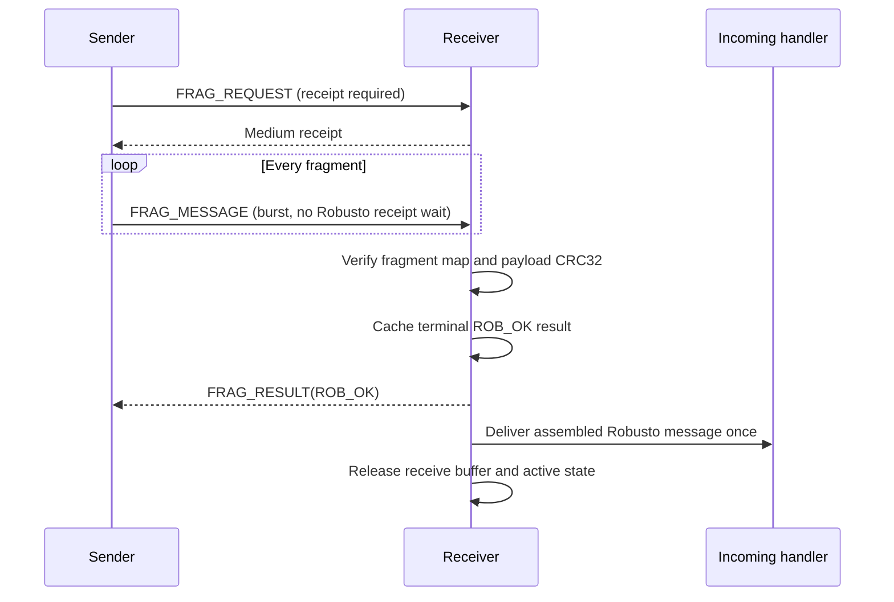

# Fragmented Message Protocol

Robusto uses the fragmented-message protocol when a complete Robusto message is larger than the selected medium can carry in one transmission. The protocol transfers the payload as a burst, verifies the complete payload with CRC32, repairs missing fragments, and reports one terminal result to the sender. 
The burst does not wait between sending the fragments, maximizing performance while minimizing the bandwith costs  

The implementation is in `src/message/robusto_message_fragment.c`.

## Design goals

- Preserve the original Robusto message as one end-to-end delivery.
- Send payload fragments as a burst instead of waiting after every fragment.
- Detect missing, malformed, and corrupted data before delivery.
- Retry only missing fragments when receive state is still available.
- Avoid duplicate application delivery when a terminal result is lost.
- Keep active transfers separate by peer, medium, and message hash.
- Bound retained state and release large receive buffers immediately after completion.

## Message identity and ownership

A transfer is identified by:

```text
(peer, media_type, payload_crc32)
```

The CRC32 is both the transfer hash and the end-to-end integrity check. Active receive state is looked up using all three fields. Different peers can therefore transfer on the same medium independently.

The receiver permits one active receive transfer for each `(peer, media_type)` pair. A new request with a different hash replaces an abandoned receive for that same pair. It does not replace a transfer owned by another peer or medium.

## Packet types

All packet sizes below include the four-byte Robusto CRC/hash prefix and the two fragmented-message type bytes.

| Packet | Direction | Contents | Send receipt |
| --- | --- | --- | --- |
| `FRAG_REQUEST` | Sender to receiver | Total bytes, fragment count, fragment size, payload CRC32 | Required |
| `FRAG_MESSAGE` | Sender to receiver | Payload CRC32, zero-based fragment index, fragment bytes | Not required |
| `FRAG_CHECK` | Sender to receiver | Payload CRC32 | Not required |
| `FRAG_RESEND` | Receiver to sender | Payload CRC32 and one byte per fragment | Not required |
| `FRAG_RESULT` | Receiver to sender | Payload CRC32 and a signed 16-bit `rob_ret_val_t` result | Not required |

`FRAG_REQUEST` has its own CRC over its metadata. Other fragmented packets use the payload CRC32 in the first four bytes as their transfer reference.

The current wire representation writes integer fields with `memcpy`, so peers are expected to use the same integer byte order.

### Payload burst semantics

`FRAG_MESSAGE` packets use `receipt=false`. This means Robusto does not synchronously wait for the medium send-completion callback after each fragment. It does not disable reliability implemented below Robusto. For example, ESP-NOW can still perform MAC acknowledgement and driver retries.

End-to-end reliability comes from `FRAG_RESULT`, `FRAG_CHECK`, `FRAG_RESEND`, and the complete-payload CRC32.

## Normal transfer



The sender calculates:

```text
fragment_count = ceil(payload_length / fragment_size)
```

No zero-length trailing fragment is sent when the payload length is exactly divisible by the fragment size.

The receiver allocates the complete receive buffer and a one-byte-per-fragment receive map after accepting `FRAG_REQUEST`. Each valid `FRAG_MESSAGE` is copied to the offset determined by its index. Out-of-order fragments are valid. A duplicate fragment overwrites the same range and leaves that map entry marked as received.

## Missing or reordered fragments

Receiving the last numbered fragment does not immediately cause a resend request. Earlier fragments may still be in flight because payload packets are sent as a burst.

If the last fragment arrives while entries are missing, the receiver keeps the active state and waits. The sender waits 250 ms for `FRAG_RESULT`, then sends `FRAG_CHECK`.

On `FRAG_CHECK`:

1. The receiver scans the receive map.
2. If entries are missing, it sends `FRAG_RESEND` containing the complete map.
3. A map byte of `1` means already received; `0` means resend this fragment.
4. The sender resends only zero entries.
5. When the last requested fragment arrives, the receiver checks the map and complete CRC again.

The fragmented retry phase is limited to 1000 ms. The complete fragmented send has a 30000 ms upper bound.

## Completion and lost results

After successful assembly, the receiver retains no JPEG or other payload buffer. It stores only a small completion record containing:

```text
peer, media_type, payload_crc32, terminal_result, completion_time
```

The completion cache has eight fixed slots. Entries expire after 2000 ms, which covers four complete result/check windows. If all slots are occupied, the oldest entry is replaced.

This cache closes two acknowledgement-loss cases:

### Lost `FRAG_RESULT`

If the first `FRAG_RESULT` is lost, the sender issues `FRAG_CHECK`. Active receive state has already been released, so the receiver looks in the completion cache and repeats the cached result.

### Whole-message retry

The queue worker can retry a receipt-requiring high-level send up to three total attempts. If that retry begins with the same `FRAG_REQUEST` while its completion record is current, the receiver immediately repeats the cached result. It does not allocate another receive buffer and does not deliver the payload again.

Completion records are isolated by peer, medium, and hash. A request or check from another peer, on another medium, or for another hash cannot match the record.

## CRC failure

After all fragments are present, the receiver calculates CRC32 over the assembled payload.

- Matching CRC: cache and send `FRAG_RESULT(ROB_OK)`, then deliver once.
- Mismatching CRC: cache and send `FRAG_RESULT(ROB_ERR_WRONG_CRC)`, do not deliver, and release active state.

A late check or duplicate request can replay either terminal result while its completion record remains current.

## Duplicate and overlapping input

| Situation | Receiver behavior |
| --- | --- |
| Duplicate request for an active identical transfer | Keep the existing buffers, refresh its activity time, and allocate nothing. |
| Duplicate request for a recently completed transfer | Replay the cached terminal result; allocate and deliver nothing. |
| New hash for the same peer and medium | Remove the abandoned active receive, then start the new transfer. |
| Same hash from another peer | Treat as an independent transfer. |
| Same hash on another medium | Treat as an independent transfer. |
| Duplicate fragment | Copy to the same indexed range and keep the map entry set. |
| Fragment for unknown or replaced state | Reject as an invalid fragment reference. |

## Validation and rejection

The receiver rejects or records errors for:

- `FRAG_REQUEST` shorter than its required metadata.
- Request metadata CRC mismatch.
- Fragment index outside the announced count.
- Fragment length different from the expected size.
- `FRAG_RESEND` map length different from the fragment count.
- Fragment, result, resend, or check references with no matching active or completed transfer.
- Unknown fragmentation subtype.
- Allocation failure for state, receive buffer, or fragment map.

Invalid packets are not passed to the application incoming handler.

## Stale and bounded state

Active receive state is reclaimed when it is older than 30000 ms. A new valid request triggers stale-state cleanup before allocating its receive buffer.

Recently completed state is separate from active state:

- It is a fixed eight-entry array.
- It owns no payload or fragment map.
- It expires by elapsed time using wrap-safe unsigned subtraction.
- It uses oldest-entry replacement when full.
- It is cleared when the fragmentation module initializes.

This keeps acknowledgement-loss protection deterministic and independent of payload size.

## Sender states and waits

The sender uses these states:

| State | Meaning |
| --- | --- |
| `ROB_ST_RUNNING` | Request or initial burst is in progress. |
| `ROB_ST_DONE` | Initial burst was submitted; terminal result is unknown. |
| `ROB_ST_PAUSED` | A status check was sent and the sender is waiting for its answer. |
| `ROB_ST_RETRYING` | Missing fragments are being resent. |
| `ROB_ST_SUCCEEDED` | Receiver returned `ROB_OK`. |
| `ROB_ST_FAILED` | Receiver returned failure or CRC mismatch. |
| `ROB_ST_TIMED_OUT` | A protocol deadline expired. |
| `ROB_ST_ABORTED` | Transmission was explicitly aborted. |

Current waits are:

| Limit | Value |
| --- | ---: |
| Running-state wait | 500 ms |
| Initial result wait | 250 ms |
| Status-check wait | 250 ms |
| Resend phase total | 1000 ms |
| Fragmented send total | 30000 ms |
| Completed-result retention | 2000 ms |

QoS activity is postponed while a fragmented transfer is active so heartbeat or scoring work does not interrupt the burst.

## Memory ownership

- Sender state references the caller's payload; it does not copy the complete send payload.
- The sender allocates one fragment map and one reusable fragment packet buffer.
- The receiver allocates one complete payload buffer and one fragment map.
- On successful delivery, ownership of the assembled buffer passes to `robusto_handle_incoming()`.
- On failure, replacement, or timeout, fragmentation releases its buffers.
- Completion records contain no dynamic pointers other than the stable peer identity pointer.

## Current assumptions and limits

- The caller supplies a non-zero payload length and fragment size.
- The receive map currently uses one byte per fragment rather than a bitmap.
- The payload CRC32 is used as the transfer identifier; it is an integrity and deduplication key, not a cryptographic identity.
- Only one active receive is retained per peer and medium. Independent peers and media remain independent.
- Completion deduplication is intentionally time-bounded. A transfer repeated after expiry is treated as a new transfer.

## Tests

Fragmentation tests in `test/tst_fragmentation.c` cover:

- divisible and non-divisible fragment counts;
- absence of zero-length trailing fragments;
- burst payload sends without per-fragment receipt waits;
- missing-fragment repair only after an explicit check;
- active duplicate-request state reuse;
- stale receive reclamation;
- same-peer/media abandoned receive replacement;
- CRC mismatch cleanup;
- late-check result replay;
- duplicate-request result replay without new receive state;
- completion-key isolation by peer, medium, and hash.
